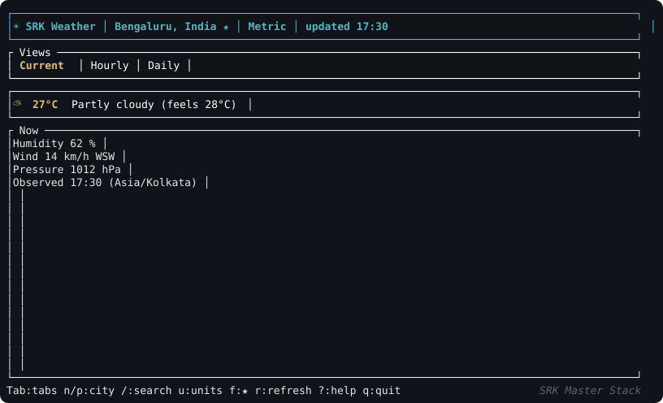
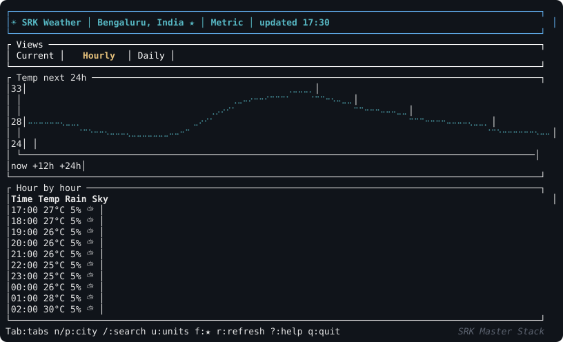
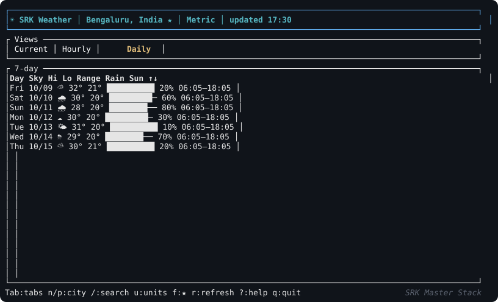

# ☀ SRK Weather TUI


A cool keyboard-driven terminal weather app in **Rust**.
Built as part of the **SRK Master Stack** series — look for the watermark, bottom-right, on every screen.

```text
┌ ☀ SRK Weather  │  Bengaluru, India ★  │  Metric  │  updated 17:30 ──────────┐
│ Views:  Current │ Hourly │ Daily                                          │
│ ☀ 19°C  Partly cloudy  (feels 17°C)                                      │
│ Humidity  70 %      Wind  12 km/h WSW      Pressure  1013 hPa              │
│ Tab:tabs n/p:city /:search u:units f:★ r:refresh ?:help q:quit │ SRK Master Stack
```

> Folder contents: `readme.md` (you are here) ·
> `Cargo.toml` · `src/main.rs` (app + loop) · `src/weather.rs` (API) · `src/ui.rs` (rendering) ·
> `src/shot.rs` (SVG screenshot generator) · `assets/` (screenshots + demo)

---

## Features (everything included)

| # | Feature | How |
|---|---------|-----|
| 1 | **Current conditions** | Big temp + unicode icon (☀🌤⛅🌧⛈❄🌫), feels-like, humidity, wind + compass (N…NNW), pressure, observation time |
| 2 | **Hourly tab** | Next-24h table (time, temp, rain %, icon) + braille **line chart** of temperature |
| 3 | **Daily tab** | 7-day table: icon, hi/lo, min/max range bar, rain %, sunrise–sunset |
| 4 | **City search** | `/` → type → Enter → top-5 results → ↑/↓ + Enter |
| 5 | **7 preset cities** | Bengaluru, London, New York, Tokyo, Nairobi, Sydney, Rio — cycle with `n`/`p` |
| 6 | **Units toggle** | `u` flips Metric (°C, km/h) ↔ Imperial (°F, mph), refetches automatically |
| 7 | **Favorites ★** | `f` toggles; persisted to `~/.srk_weather_favorites.json` |
| 8 | **Refresh** | `r` manual + auto-refresh every 10 min |
| 9 | **Help screen** | `?` shows every keybinding |
| 10 | **Watermark** | `SRK Master Stack` bottom-right on **every** screen (tested in CI-style render tests) |
| 11 | **CLI options** | `--city "Name"`, `--fahrenheit`/`--imperial`, `--help` |
| 12 | **Robust states** | Loading spinner text, friendly errors with retry, small-terminal guard, terminal always restored (even on panic) |

## Screenshots (all tabs)

The animation above is a real recording of the UI — it loops through loading → Current →
Hourly → Daily → city search → results → help. Regenerate it with
`cargo run -- --screenshot demo > assets/demo.svg`.

**How it was recorded:** no screen recorder — `src/shot.rs` renders the actual `ui::draw()`
headlessly via ratatui's `TestBackend` (100×30 cells) using showcase Bengaluru data, converts
cells to SVG, and stitches 12 states into one looping animation. Same draw code the TUI runs,
so it's pixel-faithful by construction.

Static frames (regenerate with `cargo run -- --screenshot [current|hourly|daily]`):







## Install & run

```bash
rustc --version            # need stable 1.70+
cargo build --release      # zero warnings
cargo run --release        # start with default city (Bengaluru)
cargo run -- --city "Paris" --fahrenheit
cargo run -- --help
cargo test                 # 6 tests: parsing, compass, WMO, headless render + watermark
```

Needs internet access (HTTPS). No key, no account.

## Keybindings

| Key | Action |
|-----|--------|
| `1` `2` `3`, `Tab`, `←`/`→`, `h`/`l` | Switch tabs |
| `n` / `p` | Next / previous preset city |
| `/` | Search city (type, `Enter` = search, `↑`/`↓` + `Enter` = select, `Esc` = cancel) |
| `u` | Toggle Metric ↔ Imperial |
| `f` | Favorite ★ current city |
| `r` | Refresh now |
| `?` | Help (press `?`/`Esc` to close) |
| `q` / `Esc`, `Ctrl+C` | Quit |

## Options reference

- `--city "Name"`: preset substring match first (e.g. `tok` → Tokyo), else geocodes and takes the top hit; offline/failure falls back to Bengaluru with an error notice in-app.
- `--fahrenheit` / `--imperial`: start in Imperial units (`u` still toggles live).
- Favorites file: `~/.srk_weather_favorites.json` (JSON array of city keys; delete it to reset; unwritable → in-memory only).
- Auto-refresh: every 10 minutes of idle time.

## How it works (60 seconds)

- `src/weather.rs` — blocking `reqwest` (rustls, no system TLS needed) fetches forecast + geocoding; defensive `Option`-heavy structs so a missing field degrades to `--` instead of crashing; WMO-code → icon map; 16-point compass; `len`/`cap`-style unit param builders.
- `src/main.rs` — `App` state machine (`Loading → Ready ⇄ Search/Error`), 250 ms `crossterm::poll` loop, panic hook + normal path both restore the terminal.
- `src/ui.rs` — pure render of `&App` with ratatui: header / tabs / body / status bar; status bar is split so the watermark always sits bottom-right.

## Troubleshooting

| Symptom | Fix |
|---------|-----|
| `Couldn't load weather` | No network / API down — press `r` to retry |
| `search failed` | Same — check connection, retry |
| Garbled/blank TUI | Terminal < 80x24 — enlarge; `q` then rerun restores shell |
| Units look wrong | Press `u`; header shows current system |
| City missing from presets | Press `/` and search any place on Earth |
| Broken shell after crash | Panic hook restores it; run `reset` if your terminal still misbehaves |

## Roadmap (not yet built)

Slices of radar maps, precipitation charts, alerts (WMO warnings API), `$XDG_CONFIG_HOME` config file for defaults, `i18n` city names.

## Credits

- TUI: [ratatui](https://ratatui.rs) + [crossterm](https://github.com/crossterm-rs/crossterm).
- Watermark: **SRK Master Stack**.
